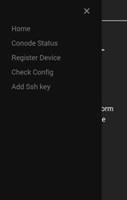
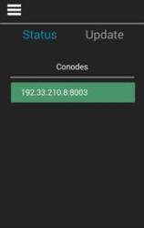
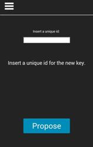
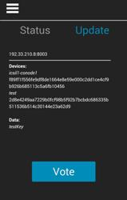

# CothorityMobile  
EPFL Bachelor Project, Spring 2017.

A mobile application developed with [PhoneGap](https://phonegap.com/), which allows to manage SSH-keys using the [cothority-framework](https://github.com/dedis/cothority).

## Installation
First install [npm](https://www.npmjs.com/get-npm?utm_source=house&utm_medium=homepage&utm_campaign=free%20orgs&utm_term=Install%20npm), then run `npm i` to install dependencies and `npm i -g phonegap` to install PhoneGap.
 
## Run
[Here](http://docs.phonegap.com/getting-started/1-install-phonegap/cli/) you find the official tutorial which explains how to preview a PhoneGap application on a real device.

Alternatively - if you are using an Android device - you can directly install the _cothority_mobile-debug.apk_ on your phone.

## Features
- Overview conode status
- [CISC]() service
    - Add device to an existing access-control-list (via qr-code)
    - Overview all devices and data stored in an access-control-list
    - Vote on proposal
    - Make proposition

## Requirements
- Camera permission
- A running Cothority

## Related libraries
- [CothorityProtoBuf](https://github.com/Gilthoniel/CothorityProtoBuf)
- [CryptoJS](https://github.com/Gilthoniel/CryptoJS)

## License
[GNU/AGPL 3.0](https://www.gnu.org/licenses/agpl-3.0.en.html) license, see the [LICENSE](./LICENSE.AGPL) file for more details.

## Author
Lucio Romerio - _Development_ - [lromerio](https://github.com/lromerio)

## Acknowledgements
- Prof. Bryan Ford - _Responsible_
- Linus Gasser - _Supervisor_
- Gaylor Bosson - _Libraries setup_ - [Gilthoniel](https://github.com/Gilthoniel)

## Screenshots
    
